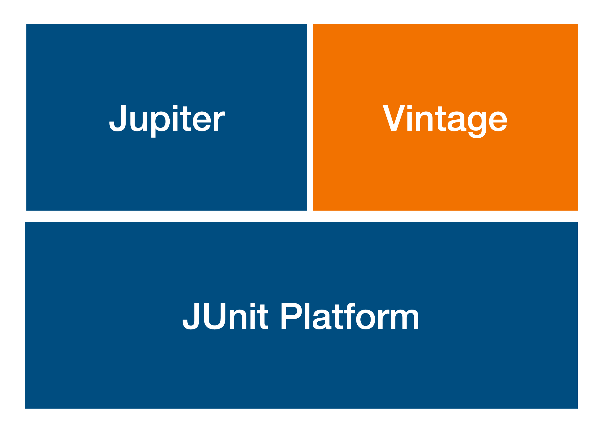

# JUnit5 란?

## JUnit 이란

- 자바 프로그래밍을 지원하는 단위 테스트 프레임워크이다.

  > 단위 테스트란?

  - 하나의 모듈을 기준으로 독립적으로 진행되는 가장 작은 단위의 테스트이다.
  - 메소드가 의도한대로 동작하는지 테스트한다.
  - 어떤 부분이 문제인지 빠르게 확인할 수 있다.

- 자바8 이상을 필요로 한다.

- TestNg, Spock... 에 비해 가장 많이 사용된다.

## JUnit 구조

- JUnit Platform: TestEngine API를 제공한다.

  > https://junit.org/junit5/docs/5.0.1/api/org/junit/platform/engine/TestEngine.html

- Vintage: JUnit3, JUnit4를 지원하는 TestEngine의 구현체이다.

- Jupiter: JUnit5 TestEngine의 구현체이다.