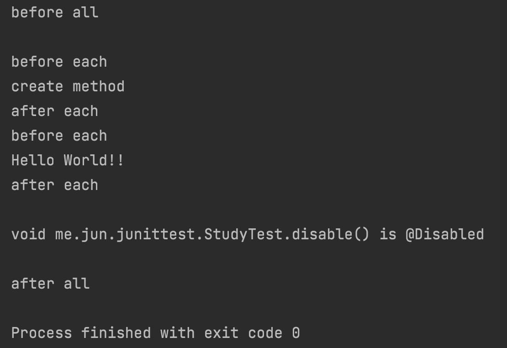
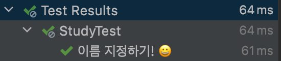
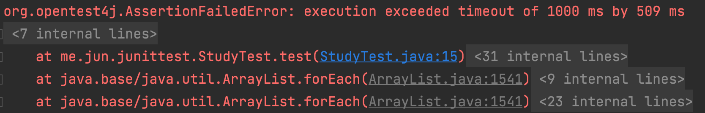

# JUnit5 사용하기

### 목차

1. JUnit5 시작하기
2. 기본 애너테이션
3. 테스트 이름 표시
4. Assert
5. AssertJ

___


## 1. JUnit5 시작하기

- 스프링 부트 프로젝트 생성하기

  > 스프링 부트 2.2+ 버전 사용시 기본으로 JUnit5가 추가됨

- 스프링 부트 프로젝트를 생성하지 않는다면

  ```java
  dependencies {
      testImplementation 'org.junit.jupiter:junit-jupiter-api:5.3.1'
      testRuntimeOnly 'org.junit.jupiter:junit-jupiter-engine:5.3.1'
  }
  ```


## 2. 기본 애너테이션

- @Test

  > 해당 메소드를 테스트 대상을 지정한다. 접근 제어자는 설정하지 않아도 된다.

- @BeforeAll / @AfterAll

  > 전체 메소드를 수행하기 전/후에 수행되는 메소드를 지정한다. (한 번만 수행된다.) 반드시 static void로 작성해야 한다!! (테스트는 각 메소드마다 다른 인스턴스를 사용하기 때문이다.) 자세한 내용은 JUnit ETC...  참조

- @BeforeEach / @AfterEach

  > 각 메소드를 수행하기 전/후에 수행되는 메소드를 지정한다. (메소드의 수만큼 수행된다.)

- @Disabled

  > 해당 메소드를 수행하지 않는다.

```java
import org.junit.jupiter.api.*;

import static org.junit.jupiter.api.Assertions.*;

class StudyTest {

    @Test
    void create() {
        Study study = new Study();
        assertNotNull(study);

        System.out.println("create method");
    }

    @Test
    void print_hello() {
        System.out.println("Hello World!!");
    }

    @Test
    @Disabled
    void disable() {
        System.out.println("disable method");
    }

    @BeforeAll
    static void beforeAll() {
        System.out.println("before all\\n");
    }

    @AfterAll
    static void afterAll() {
        System.out.println("\\nafter all");
    }

    @BeforeEach
    void beforeEach() {
        System.out.println("before each");
    }

    @AfterEach
    void afterEach() {
        System.out.println("after each");
    }
}
```




## 3. 테스트 이름 표시

> 기본적으로 테스트 실행시 메소드의 이름이 테스트의 이름으로 표시된다.

- @DisplayNameGeneration

  > 클래스나 메소드에서 사용하여 naming 전략을 선택할 수 있다.

- @DisplayName

  > 메소드의 이름을 지정할 수 있다.

```java
		@Test
    @DisplayName("이름 지정하기! 😀")
    void create() {
        Study study = new Study();
        assertNotNull(study);

        System.out.println("create method");
    }
```



## 4. Assert

- assertNotNull

  > 값이 null이 아닌지 검사한다.

- assertEquals

  > 값이 기대값과 같은지 검사한다.

- assertTrue

  > 값이 true인지 확인한다.

- assertAll

  > assertAll의 모든 내용을 검사한다.

  ```java
  @Test
      @DisplayName("assert")
      void create() {
          Study study = new Study();
          assertAll(
                  () -> assertNotNull(study),
                  () -> assertEquals(StudyStatus.DRAFT, study.getStatus(),
                      () -> "Study를 처음 만들면 status가 " + StudyStatus.DRAFT + "이다."),
                  () -> assertTrue(1 > 0)
          );
      }
  ```

  > assertAll을 사용하지 않을 경우, 1, 2, 3개의 assert 중 2번이 통과되지 않으면 3번 assert를 검사하지 않는다.

- assertThrows

  > 예외 발생을 검사한다.

  ```java
  @Test
      @DisplayName("assert")
      void test() {
          IllegalStateException err = assertThrows(IllegalStateException.class, () -> {
              throw new IllegalStateException("테스트!");
          });
  
          assertEquals("테스트!", err.getMessage());
      }
  ```

- assertTimeout

  > 시간 내에 메소드가 수행되는지 확인한다. assertTimeoutPreemptively를 사용하면 설정된 시간이 지나는 즉시 테스트에 실패하고 해당 메소드를 종료한다.

  ```java
  @Test
      @DisplayName("assert")
      void test() {
          assertTimeout(Duration.ofMillis(1000), () -> {
              new Study();
              Thread.sleep(1500);
          });
      }
  ```

  

- ... etc

## 5. AssertJ

> AssertJ를 이용하면 메소드 체이닝을 이용한 조금 더 편리하고, 가독성이 좋은 테스트를 작성할 수 있다.

```java
package me.jun.junittest;

import org.junit.jupiter.api.*;

import java.util.ArrayList;
import java.util.List;

import static org.assertj.core.api.Assertions.*;

@DisplayNameGeneration(DisplayNameGenerator.Simple.class)
class StudyTest {

    class Person {

        private String name;

        public Person(String name) {
            this.name = name;
        }
    }

    @Test
    @DisplayName("assert")
    void test() {
        String expected = "test!!!";
        assertThat("test!!!").isEqualTo(expected);

        List<Person> list = new ArrayList<>();

        list.add(new Person("pop"));
        list.add(new Person("six"));
        list.add(new Person("squish"));
        list.add(new Person("uh uh"));
        list.add(new Person("cicero"));
        list.add(new Person("lipschitz"));

        assertThat(list)
                .filteredOn("name", notIn("lipschitz", "cicero"))
                .extracting("name")
                .contains("pop", "six", "squish", "uh uh");
    }
}
```

> 자세한 내용은 구글링...