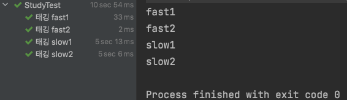

# JUnit5 심화하기

### 목차

1. 조건에 따라 테스트 실행
2. 태깅, 필터링과 함께 테스트하기
3. 테스트 반복하기

------


## 1. 조건에 따라 테스트 실행

환경변수 설정에 따라 테스트를 실행할 수 있다.

> 1. 메서드를 이용해서 조건에 따라 테스트하기
> 2. 어노테이션을 이용해서 조건에 따라 테스트하기

우선 환경변수를 세팅해준다.

```java
vim ~/.zshrc
```


그리고 IntelliJ 를 재시작 해준다. (환경변수는 IntelliJ가 시작될 때 읽어진다.)

```java
import org.junit.jupiter.api.DisplayName;
import org.junit.jupiter.api.Test;

class StudyTest {

    @Test
    @DisplayName("조건에 따라 테스트하기")
    void test() {
        String test_env = System.getenv("TEST_ENV");
        System.out.println(test_env);
    }
}
```


환경변수가 제대로 세팅된 것을 확인할 수 있다.


### 1.1 메서드를 이용해서 조건에 따라 테스트하기

```java
		@Test
    @DisplayName("조건에 따라 테스트하기")
    void test() {
        String test_env = System.getenv("TEST_ENV");

        assumeTrue("LOCAL".equalsIgnoreCase(test_env));

        System.out.println("LOCAL run");
    }
```

첫번째 방법은 assumeTrue 를 이용해서 조건이 만족하면 테스트가 실행 되도록 하는 것이다.

```java
		@Test
    @DisplayName("조건에 따라 테스트하기")
    void test() {
        String test_env = System.getenv("TEST_ENV");

        assumingThat("test".equalsIgnoreCase(test_env), () -> {
            System.out.println("test run!");
        });

        assumingThat("LOCAL".equalsIgnoreCase(test_env), () -> {
            System.out.println("LOCAL run!");
        });
    }
```


두번째 방법은 assumingThat을 이용하는 것이다.

이 방법을 사용하면 여러 조건들에 대해서 각각 만족하는 테스트를 실행할 수 있게 해준다.

### 1.2 어노테이션을 이용해서 조건에 따라 테스트하기

각 메서드에 어노테이션을 붙여주면 된다.

```java
// 운영체제 조건에 따라 테스트를 실행해주는 어노테이션
@EndabledOnOs({OS.MAC, OS.LINUX})
@DisabledOnOs(OS.MAC)

// JRE 조건에 따라 테스트를 실행해주는 어노테이션
@EnabledOnJre({JRE.JAVA_8, JRE.JAVA_9, JRE.JAVA_10, JRE>JAVA_11})
@DisabledOnJre(JRE.OTHER)

// 환경변수에 따라 테스트를 실행해주는 어노테이션
@EnabledIfEnvironmentVariable(named = "TEST_ENV", matches = "LOCAL")
@DisabledIfEnvironmentVariable(named = "TEST_ENV", matches = "test")
```


## 2. 태깅, 필터링과 함께 테스트하기

태깅은 각 테스트에 태그를 달아서 구별할 수 있게 해주는 것을 말한다.

(같은 태그끼리만 테스트를 실행할 수도 있다.)

먼저 코드를 다음과 같이 작성한 후, 테스트를 실행하면 사진과 같은 결과가 나온다.

```java
import org.junit.jupiter.api.DisplayName;
import org.junit.jupiter.api.Tag;
import org.junit.jupiter.api.Test;

class StudyTest {

    @Test
    @DisplayName("태깅 fast1")
    @Tag("fast")
    void fast1() {
        System.out.println("fast1");
    }

    @Test
    @DisplayName("태깅 fast2")
    @Tag("fast")
    void fast2() {
        System.out.println("fast2");
    }

    @Test
    @DisplayName("태깅 slow1")
    @Tag("slow")
    void slow1() {
        try {
            Thread.sleep(5000);
        } catch (InterruptedException e) {
            e.printStackTrace();
        }
        System.out.println("slow1");
    }

    @Test
    @DisplayName("태깅 slow2")
    @Tag("slow")
    void slow2() {
        try {
            Thread.sleep(5000);
        } catch (InterruptedException e) {
            e.printStackTrace();
        }
        System.out.println("slow2");
    }
}
```



IntelliJ 에서 테스트를 실행하면 테그와 상관없이 모든 메서드가 실행된다.

config설정을 해주어야 tag별로 테스트를 실행할 수 있다.

우측 상단에 Edit configurations 를 누르고,

실행되는 테스트를 class → tag로 바꾼 후 실행할 tag를 입력해주면 된다.


(빨간 글씨는 tag가 매칭되지 않아서 테스트가 실행되지 않았다는 것이다. - slow tag)

ci 환경에서 태그에 따라 필터링 테스트를 하려면, 추가로 설정을 해주어야 한다.


## 3. 테스트 반복하기

@RepeatedTest 어노테이션 사용시 테스트를 반복할 수 있다.

```java
import org.junit.jupiter.api.DisplayName;
import org.junit.jupiter.api.RepeatedTest;
import org.junit.jupiter.api.RepetitionInfo;

class StudyTest {

    @RepeatedTest(value = 10, name = "{displayName}, {currentRepetition}/{totalRepetitions}")
    @DisplayName("반복")
    void test(RepetitionInfo reInfo) {
        System.out.println("test " + reInfo.getCurrentRepetition() + "/"
                + reInfo.getTotalRepetitions());
    }
}
```


name = "{displayName}, {currentRepetition}/{totalRepetitions}" 부분은 생략할 수 있으며, 테스트의 이름을 결정하는 부분이다.

단순 반복 테스트가 아닌, 테스트마다 다른 값을 주고 싶다면

@ParameterizedTest와 @ValueSource 를 사용하면 된다.

```java
		@ParameterizedTest
    @ValueSource(strings = {"봄", "여름", "가을", "겨울"})
    @DisplayName("계절")
    void test(String value) {
        System.out.println(value);
    }
```


@ValueSource에서 strings가 아닌 ints, chars 등 다향한 자료형을 사용할 수 있다.

또한 이 테스트에서도

@ParameterizedTest(name = "{index}: value={0}") 와 같이 테스트의 이름을 정할 수 있다.

```java
		@ParameterizedTest(name = "{index}: value={0}")
    @ValueSource(strings = {"봄", "여름", "가을", "겨울"})
    @EmptySource @NullSource
    @DisplayName("계절")
    void test(String value) {
        System.out.println(value);
    }
```


또한 위와 같이 @EmptySource 와 @NullSource 를 사용하면 각 어노테이션의 값을 추가로 테스트할 수 있다.

SimpleArgumentConverter를 extends하여 매개변수를 자신이 원하는 타입으로 받을 수도 있다.

단 이때는 @ConvertWith 어노테이션을 붙여서 명시를 해주어야 한다.

```java
import org.junit.jupiter.api.DisplayName;
import org.junit.jupiter.params.ParameterizedTest;
import org.junit.jupiter.params.converter.ArgumentConversionException;
import org.junit.jupiter.params.converter.ConvertWith;
import org.junit.jupiter.params.converter.SimpleArgumentConverter;
import org.junit.jupiter.params.provider.ValueSource;

import static org.junit.jupiter.api.Assertions.assertEquals;

class StudyTest {

    static class ForTest {

        private String string;

        public ForTest(String string) {
            this.string = string;
        }

        public String getString() {
            return string;
        }
    }

    static class Converter extends SimpleArgumentConverter {

        @Override
        protected Object convert(Object source, Class<?> targetType) throws ArgumentConversionException {
	          // ForTest class만 convert 한다.
						assertEquals(ForTest.class, targetType, "Can only convert to ForTest");
            return new ForTest(source.toString());
        }
    }

    @ParameterizedTest(name = "{index}: value={0}")
    @ValueSource(strings = {"봄", "여름", "가을", "겨울"})
    @DisplayName("계절")
    void test(@ConvertWith(Converter.class) ForTest forTest) {
        System.out.println(forTest.getString());
    }
}
```

@ParameterizedTest 에 @ValueSource 가 아닌 @CvsSource를 사용할 수 있다.

```java
import org.junit.jupiter.api.DisplayName;
import org.junit.jupiter.params.ParameterizedTest;
import org.junit.jupiter.params.provider.CsvSource;

class StudyTest {

    class ForTest {

        private String s;
        private int i;

        public ForTest(String s, int i) {
            this.s = s;
            this.i = i;
        }

        public int getI() {
            return i;
        }

        public String getS() {
            return s;
        }

        @Override
        public String toString() {
            return "ForTest{" +
                    "s='" + s + '\\'' +
                    ", i=" + i +
                    '}';
        }
    }

    @ParameterizedTest(name = "{index}: value={0}")
    @CsvSource({"'글1', 1", "'글2', 2", "'글3', 3", "'글4', 4"})
    @DisplayName("테스트")
    void test(String string , int integer) {
        ForTest forTest = new ForTest(string, integer);
        System.out.println(forTest);
    }
}
```


이밖에도 @EnumSource, @MethodSource, @CvsFileSource, @ArgumentSource 등이 있다.

| 어노테이션       | 설명                                                         |
| ---------------- | ------------------------------------------------------------ |
| @ValueSource     | 테스트 메서드에 원시 자료형 배열을 제공한다.                 |
| @EnumSource      | 테스트 메서드에 열거형 배열을 제공한다. 특정 열거형 타입으로부터 모든 객체를 가져오거나, 일부 객체만 가져올 수도 있으며, 옵션에 따라 일부 제외 및 정규표현식을 이용한 선택이 가능하다. |
| @MethodSource    | 테스트 메서드가 요구하는 인자 타입의 스트림Stream(혹은 Iterable, Iterator)을 반환하는 메서드를 지정하여 인자를 제공한다. 스트림을 제공하는 메서드는 클래스 단위 생명주기가 아닌 경우, 정적 메서드여야 한다. |
| @CsvSource       | 이 어노테이션은 쉼표로 분리된 데이터(문자열)를 가지는 배열을 테스트 메서드에 제공한다. 테스트 메서드는 한 개 이상의 인자를 제공받을 수 있다. |
| @CsvFileSource   | 이 어노테이션은 CSV 파일을 사용하여 테스트 메서드에 인자를 제공한다. |
| @ArgumentsSource | 이 어노테이션은 @MethodSource 어노테이션과 유사한 동작을 한다. 차이점은, 인자 제공자Provider가 메서드 대신 재사용 가능한 정적 클래스라는 것이다. |

[JUnit 5 User Guide](https://junit.org/junit5/docs/current/user-guide/#writing-tests-parameterized-tests)