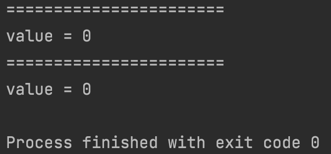
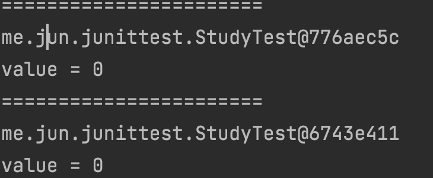
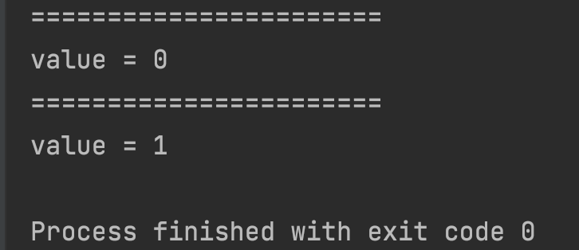
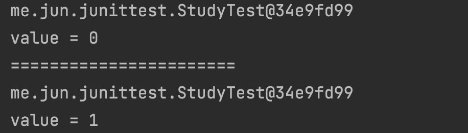
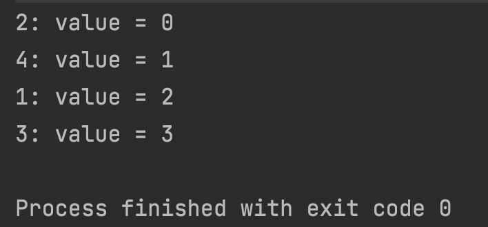
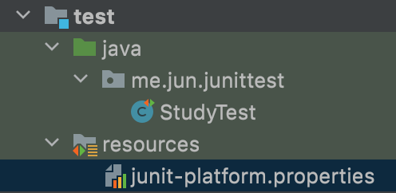

# JUnit 인스턴스와 테스트 순서, properties


## 목차

1. JUnit 인스턴스
2. 테스트 순서
3. JUnit 설정 (junit-platform.properties)

------


## 1. JUnit 인스턴스

테스트 클래스의 필드로 int value = 0; 을 선언하고,

각 메소드에서 value++를 출력하면, 어느 곳도 value = 1이 출력되지 않는다.

```java
import org.junit.jupiter.api.BeforeEach;
import org.junit.jupiter.api.Test;

class StudyTest {
    private int value = 0;

    @BeforeEach
    void printBeforeMethod() {
        System.out.println("=======================");
    }

    @Test
    void test() {
        System.out.println("value = " + value++);
    }

    @Test
    void test2() {
        System.out.println("value = " + value++);
    }
}
```



이는 메소드의 this를 출력해보면 알 수 있는 사실이다.

```java
import org.junit.jupiter.api.BeforeEach;
import org.junit.jupiter.api.Test;

class StudyTest {
    private int value = 0;

    @BeforeEach
    void printBeforeMethod() {
        System.out.println("=======================");
    }

    @Test
    void test() {
        System.out.println(this);
        System.out.println("value = " + value++);
    }

    @Test
    void test2() {
        System.out.println(this);
        System.out.println("value = " + value++);
    }
}
```



위와 같이 테스트 메소드마다 인스턴스가 바뀐다.

> ***테스트에서 인스턴스가 바뀌는 이유:**
> 테스트 간의 의존성을 없애기 위해서이다. 테스트의 순서는 예측하기 힘들기 때문에 메소드마다 다른 인스턴스를 사용하는 것을 기본으로 한다. 
> (Junit5 부터는 메소드 순서대로 실행된다고 한다.)

(하지만 당연하게도 static 변수는 공유한다.)

```java
import org.junit.jupiter.api.BeforeEach;
import org.junit.jupiter.api.Test;

class StudyTest {
    private static int value = 0;

    @BeforeEach
    void printBeforeMethod() {
        System.out.println("=======================");
    }

    @Test
    void test() {
        System.out.println("value = " + value++);
    }

    @Test
    void test2() {
        System.out.println("value = " + value++);
    }
}
```



JUnit5는 각 메소드마다 인스턴스를 다르게 하는 것이 기본이지만,

하나의 인스턴스를 사용하는 것 또한 가능한다.

@TestInstance(TestInstance.Lifecycle.PER_CLASS) 를 클래스에 사용하면 된다.

```java
import org.junit.jupiter.api.BeforeEach;
import org.junit.jupiter.api.Test;
import org.junit.jupiter.api.TestInstance;

@TestInstance(TestInstance.Lifecycle.PER_CLASS)
class StudyTest {
    private int value = 0;

    @BeforeEach
    void printBeforeMethod() {
        System.out.println("=======================");
    }

    @Test
    void test() {
        System.out.println(this);
        System.out.println("value = " + value++);
    }

    @Test
    void test2() {
        System.out.println(this);
        System.out.println("value = " + value++);
    }
}
```



또한 테스트에서 하나의 인스턴스를 사용하는 것으로 설정하면

@BeforeAll/AfterAll 을 static으로 생성하지 않아도 된다.


## 2. 테스트 순서

기본적으로 유닛 테스트는 순서에 독립적여야 한다.

각 테스트는 의존적이면 좋지 않고, 실행되는 순서와 상관 없이 결과를 보여주어야 한다.

하지만 시나리오 테스트 (회원가입 후, 로그인 등 유즈 케이스) 등에서는 각 테스트의 순서가 중요할 수 있다.

그렇기 때문에 테스트에 순서가 필요한 경우가 있다.

시나리오 테스트와 같은 경우에는 각 테스트가 같은 인스턴스를 사용하는 것이 좋다.

(같은 데이터를 가지고, 생성된 데이터를 재사용 하기 위해서)

따라서 다음과 같은 어노테이션 설정을 한다.

```java
import org.junit.jupiter.api.*;

@TestInstance(TestInstance.Lifecycle.PER_CLASS) // 하나의 인스턴스만 사용
@TestMethodOrder(? extends MethodOrderer) // MethodOrderer를 implements한 클래스
class StudyTest {

}
```

> **MethodOrderer를 구현하는 클래스들은 다음과 같다.**
> OrderAnnotation Alphanumeric Random

나는 OrderAnnotation을 사용해 볼 것이다.

```java
import org.junit.jupiter.api.*;

@TestInstance(TestInstance.Lifecycle.PER_CLASS)
@TestMethodOrder(MethodOrderer.OrderAnnotation.class)
class StudyTest {

    private int value;

    @Order(3)
    @Test
    void test1() {
        System.out.println("1: value = " + value++);
    }

    @Order(1)
    @Test
    void test2() {
        System.out.println("2: value = " + value++);
    }

    @Order(4)
    @Test
    void test3() {
        System.out.println("3: value = " + value++);
    }

    @Order(2)
    @Test
    void test4() {
        System.out.println("4: value = " + value++);
    }
}
```



결과에서 보이는 것과 같이 각 테스트가 동일한 인스턴스를 공유한다.

그리고 @Order()에서 낮은 숫자를 가질 수록 높은 우선순위를 가진다.


## 3. JUnit 설정 (junit-platform.properties)

우선 다음과 같이 test 디렉토리에 resources를 만들고, junit-platform.properties를 추가했다.



> 반드시 resources 디렉토리를 class path에 포함시켜야 한다.

위와 같이 properties 파일을 생성하면 junit에 대한 설정을 적용할 수 있다.

(모든 테스트에 일괄 적용할 때 편리하다.)

> **테스트 인스턴스 라이프사이클 설정** junit.jupiter.testinstance.lifecycle.default = per_class

**확장팩 자동 감지 기능** junit.jupiter.extensions.autodetection.enabled = true

**@Disabled 무시하고 실행하기** junit.jupiter.conditions.deactivate = org.junit.*DisabledCondition (DisabledOnCondition, DisabledOnJreCondition 등도 사용할 수 있다.)

**테스트 이름 표기 전략 설정** junit.jupiter.displayname.generator.default = \ org.junit.jupiter.api.DisplayNameGenerator$ReplaceUnderscores

> 