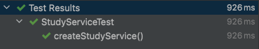
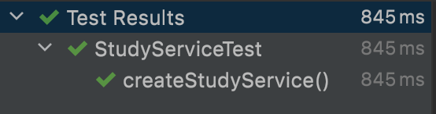

# Mockito 사용하기

## 목차

1. Mockito 시작하기
2. mock 생성
3. mock 동작 관리
4. mock 객체 검증하기
5. BDD 스타일 Mockito API

------


## 1. Mockito 시작하기

다음과 같이 spring-boot-starter-test 를 추가하면 자동으로 dependency에 추가된다.

```java
testImplementation 'org.springframework.boot:spring-boot-starter-test'
```

mock을 이용한 테스트에서는 다음 세 가지가 중요하다.

1. mock 객체를 생성하는 방법
2. mock 객체가 어떻게 동작해야 하는지 관리하는 방법
3. mock 객체의 행위를 검증하는 방법


## 2. mock 생성

> **mock():** class를 매개변수로 받아 가짜 객체를 생성해준다.

```bash
import static org.mockito.Mockito.mock;
```

위와 같이 static import를 해주면 mock()을 바로 사용할 수 있다.

```java
public StudyService(MemberService memberService, StudyRepository studyRepository) {
        assert memberService != null;
        assert studyRepository != null;
        this.memberService = memberService;
        this.studyRepository = studyRepository;
}
```

위와 같이 null이 아닌 매개변수를 받는 constructor가 있다.

```java
import java.util.Optional;

public interface MemberService {

    Optional<Member> findById(Long memberId);

    void validate(Long memberId);

    void notify(Study newStudy);

    void notify(Member member);
}
```

그리고, MemberService와 StudyRepository(JpaRepository) 는 interface만 존재하여 구현되지 않았다.

```java
import me.jun.junittest.member.MemberService;
import org.junit.jupiter.api.Test;

import static org.assertj.core.api.Assertions.assertThat;
import static org.mockito.Mockito.mock;

class StudyServiceTest {

    @Test
    void createStudyService() {
        MemberService memberService = mock(MemberService.class);
        StudyRepository studyRepository = mock(StudyRepository.class);

        StudyService studyService = new StudyService(memberService, studyRepository);

        assertThat(studyService).isNotEqualTo(null);
    }
}
```



mock을 사용하여 가짜 객체를 생성해주면 다음과 같이 테스트가 통과된다.

```java
MemberService memberService = mock(MemberService.class);
StudyRepository studyRepository = mock(StudyRepository.class);
```

위와 같이 mock()을 이용해서 mock 객체를 생성하는 것이 번거롭다면 annotation을 사용할 수 있다.

```java
import me.jun.junittest.member.MemberService;
import org.junit.jupiter.api.Test;
import org.junit.jupiter.api.extension.ExtendWith;
import org.mockito.Mock;
import org.mockito.junit.jupiter.MockitoExtension;

import static org.assertj.core.api.Assertions.assertThat;

@ExtendWith(MockitoExtension.class)
class StudyServiceTest {
a
    @Mock
    MemberService memberService;

    @Mock
    StudyRepository studyRepository;

    @Test
    void createStudyService() {
        StudyService studyService = new StudyService(memberService, studyRepository);

        assertThat(studyService).isNotEqualTo(null);
    }
}
```

위와 같이 annotation을 이용한 mock 객체도 테스트가 통과된다.

그러나 위와같이 필드로 mock 객체를 생성하는 것은 여러 테스트에서 객체를 사용한다면

편리할 수 있지만 불필요할 수 있다.

그래서 아래와 같이 메소드 파라미터를 통해서 mock 객체를 생성할 수도 있다.

```java
import me.jun.junittest.member.MemberService;
import org.junit.jupiter.api.Test;
import org.junit.jupiter.api.extension.ExtendWith;
import org.mockito.Mock;
import org.mockito.junit.jupiter.MockitoExtension;

import static org.assertj.core.api.Assertions.assertThat;

@ExtendWith(MockitoExtension.class)
class StudyServiceTest {

    @Test
    void createStudyService(@Mock MemberService memberService, @Mock StudyRepository studyRepository) {
        StudyService studyService = new StudyService(memberService, studyRepository);

        assertThat(studyService).isNotEqualTo(null);
    }
}
```


## 3. mock 동작 관리

> **mock 객체의 메소드 기본 동작:**
>
> 1. non-primitive 타입은 null을 return.
> 2. primitive 타입은 default value를 return (boolean은 false int는 0 등)
> 3. collection과 Optional은 빈 collection 또는 Optional.empty를 return
> 4. void 타입은 아무런 동작을 하지 않는다.

위와 같이 mock은 기본적인 동작이 존재한다.

하지만 다음과 같은 방법으로 동작을 제어할 수 있다.

```java
when([mock 객체의 메소드 호출]).thenReturn([원하는 결과])
import me.jun.junittest.domain.Member;
import me.jun.junittest.member.MemberService;
import org.junit.jupiter.api.Test;
import org.junit.jupiter.api.extension.ExtendWith;
import org.mockito.Mock;
import org.mockito.junit.jupiter.MockitoExtension;

import java.util.Optional;

import static org.assertj.core.api.Assertions.assertThat;
import static org.mockito.Mockito.when;

@ExtendWith(MockitoExtension.class)
class StudyServiceTest {

    @Test
    void createStudyService(@Mock MemberService memberService, @Mock StudyRepository studyRepository) {
        String memberEmail = "mock@gmail.com";
        
        when(memberService.findById(1L))
                .thenReturn(
                        Optional.of(Member.builder().id(1L).email(memberEmail).build())
                );

        StudyService studyService = new StudyService(memberService, studyRepository);

        assertThat(studyService).isNotEqualTo(null);
        
        Member member = memberService.findById(1L).get();

        assertThat(member.getEmail()).isEqualTo(memberEmail);
    }
}
```

위 상황에서는 memberService의 findById를 "[mock@gmail.com](mailto:mock@gmail.com)" email을 가진 member 객체를 반환하는 것으로 동작을 제어했다.

그러나 위 경우는 오직 id 가 1L에 해당하는 경우에만 동작을 제어했다.

따라서 다음 코드는 Optional.empty를 반환한다.

```java
	String memberEmail = "mock@gmail.com";
  
  when(memberService.findById(1L))
          .thenReturn(
                  Optional.of(Member.builder().id(1L).email(memberEmail).build())
          );

	assertThat(memberService.findById(2L)).isEqualTo(Optional.empty())
```

모든 경우에 대해서 동작을 제어하려면 다음과 같이 `ArgumentMatchers`의 any()를 사용하면 된다.

```java
 when(memberService.findById(any()))
          .thenReturn(
                  Optional.of(Member.builder().id(1L).email(memberEmail).build())
          );
```

[ArgumentMatchers (Mockito 3.3.3 API)](https://javadoc.io/static/org.mockito/mockito-core/3.3.3/org/mockito/ArgumentMatchers.html)

`ArgumentMatchers`에 대한 자세한 내용은 위 링크 참고

예외를 던지게 제어하는 것과 호출 횟수에 따라 동작을 제어하는 것 또한 가능하다.

```java
@Test
void createStudyService(@Mock MemberService memberService) {
    doThrow(new IllegalArgumentException()).when(memberService).validate(1L);

    assertThatThrownBy(() -> memberService.validate(1L)).isInstanceOf(IllegalArgumentException.class);
}
@Test
void createStudyService(@Mock MemberService memberService, @Mock StudyRepository studyRepository) {
    when(memberService.findById(1L))
            .thenReturn(Optional.of(Member.builder().id(1L).email("email").build()))
            .thenThrow(new IllegalArgumentException())
            .thenReturn(Optional.empty());

    assertThat(memberService.findById(1L).get().getEmail()).isEqualTo("email");
    assertThatThrownBy(() -> memberService.findById(1L)).isInstanceOf(IllegalArgumentException.class);
    assertThat(memberService.findById(1L)).isEqualTo(Optional.empty());
}
```


## 4. mock 객체 검증하기

verify를 이용하면 mock 객체를 검증할 수 있다.

```java
import me.jun.junittest.domain.Member;
import me.jun.junittest.domain.Study;
import me.jun.junittest.member.MemberService;
import org.junit.jupiter.api.Test;
import org.junit.jupiter.api.extension.ExtendWith;
import org.mockito.Mock;
import org.mockito.junit.jupiter.MockitoExtension;

import java.util.Optional;

import static org.mockito.Mockito.*;

@ExtendWith(MockitoExtension.class)
class StudyServiceTest {

    @Mock MemberService memberService;
    @Mock StudyRepository studyRepository;

    @Test
    void createStudyService() {
        StudyService studyService = new StudyService(memberService, studyRepository);

        Member member = new Member();
        member.setId(1L);
        member.setEmail("email");

        Study study = new Study(10, "JAVA");

        when(memberService.findById(1L)).thenReturn(Optional.of(member));
        when(studyRepository.save(study)).thenReturn(study);

        studyService.createNewStudy(1L, study);

        verify(memberService, times(1)).notify(study);
    }
}
```

> time() 를 이용하면 해당 메소드가 몇 번 실행되었는지 확인한다. never() 를 이용하면 해당 메소드가 실행되지 않았는지 확인한다. timeout() 을 이용하면 해당 메소드가 시간 제한 내에 실행되었는지 확인한다.

inOrder 를 사용하면 메소드의 호출 순서를 확인할 수 있다.

```java
public Study createNewStudy(Long memberId, Study study) {
    Optional<Member> member = memberService.findById(memberId);

    study.setOwner(member.orElseThrow(() -> new IllegalArgumentException("Member Does Not Exist")));
    memberService.notify(study);
    memberService.notify(member.get());
    return studyRepository.save(study);
}
import me.jun.junittest.domain.Member;
import me.jun.junittest.domain.Study;
import me.jun.junittest.member.MemberService;
import org.junit.jupiter.api.Test;
import org.junit.jupiter.api.extension.ExtendWith;
import org.mockito.InOrder;
import org.mockito.Mock;
import org.mockito.junit.jupiter.MockitoExtension;

import java.util.Optional;

import static org.mockito.Mockito.inOrder;
import static org.mockito.Mockito.when;

@ExtendWith(MockitoExtension.class)
class StudyServiceTest {

    @Mock MemberService memberService;
    @Mock StudyRepository studyRepository;

    @Test
    void createStudyService() {
        StudyService studyService = new StudyService(memberService, studyRepository);

        Member member = new Member();
        member.setId(1L);
        member.setEmail("email");

        Study study = new Study(10, "JAVA");

        when(memberService.findById(1L)).thenReturn(Optional.of(member));
        when(studyRepository.save(study)).thenReturn(study);

        studyService.createNewStudy(1L, study);

        InOrder inOrder = inOrder(memberService);
        inOrder.verify(memberService).notify(study);
        inOrder.verify(memberService).notify(member);
    }
}
```



위의 테스트는 메소드의 순서가 테스트와 일치하여 통과 되었다.


## 5. BDD 스타일 Mockito API

> 애플리케이션이 어떻게 **행동**해야 하는지에 대한 이해를 구성하는 방법.
> given → when → then 순서로 테스트를 구성한다.

Mockito는 BddMockito 클래스를 통해 BDD 스타일의 API를 제공한다.

**when → given**

```java
when(memberService.findById(1L)).thenReturn(Optional.of(member));
when(studyRepository.save(study)).thenReturn(study);
given(memberService.findById(1L)).willReturn(Optional.of(member));
given(studyRepository.save(study)).willReturn(study);
```

**verify → then**